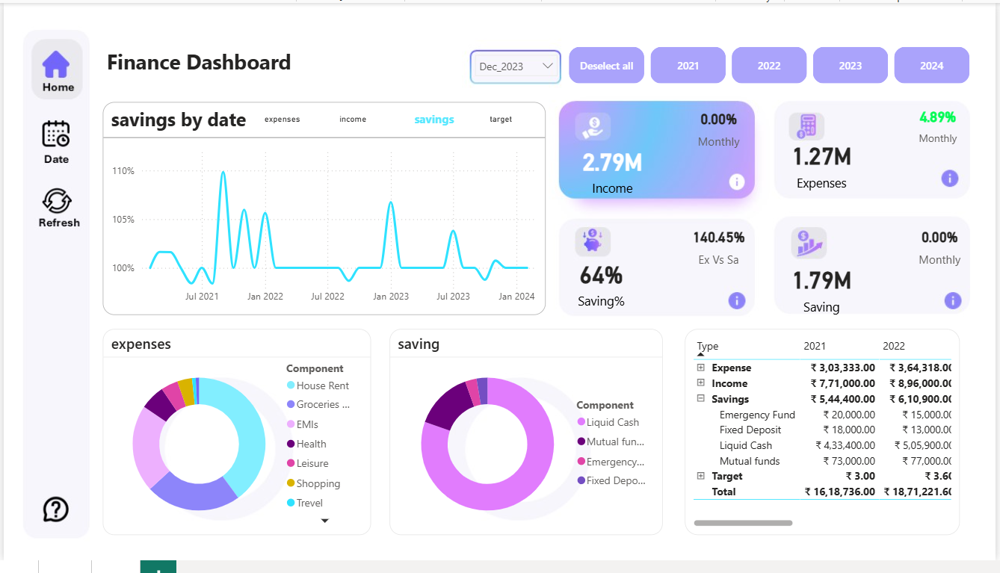
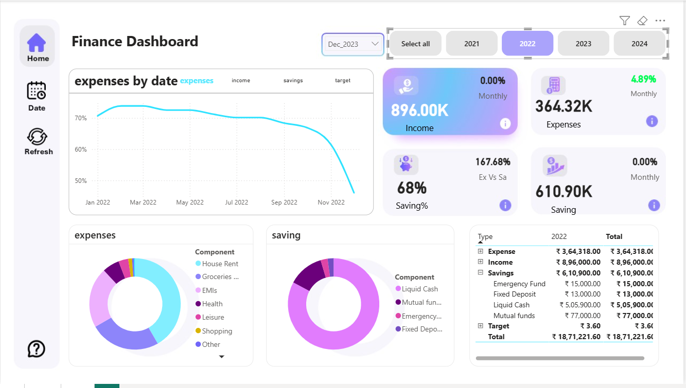
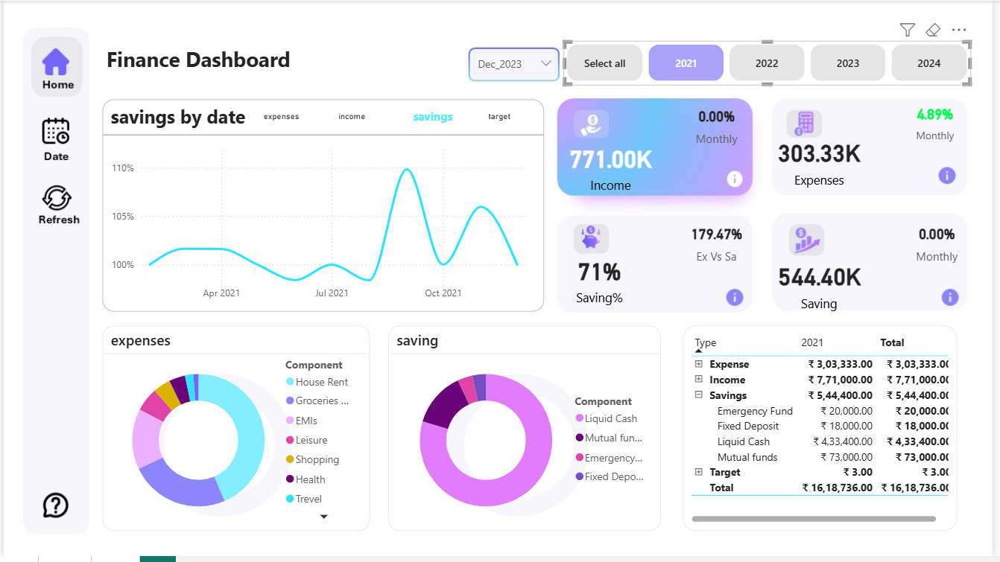

# 📈 Personal Finance Dashboard (Power BI)

A comprehensive analytics dashboard built in Power BI to track and analyze personal finance metrics, focusing on expense management, income trends, and long-term savings goals.

---

## 🎯 Key Features and Analysis

* **Expense Management:** Clearly visualizes spending allocation across categories like 'House Rent', 'Groceries', and 'EMIs', enabling granular budget control.
* **Savings vs. Target:** Tracks the savings percentage against a dynamic target over time, highlighting performance trends and volatility.
* **Year-over-Year Totals:** Provides a crucial financial snapshot with a table showing comparison of Income, Expense, and Savings totals across 2021 and 2022.

## 🛠️ Technology Stack

* **Tool:** Power BI Desktop
* **Skills Demonstrated:** Data modeling (star schema), advanced DAX calculations (for time intelligence and ratio analysis), and data visualization best practices.

---

## 🖼️ Dashboard Screenshots

### Savings Performance View

### Expenses Trend View

### Detailed Savings View

